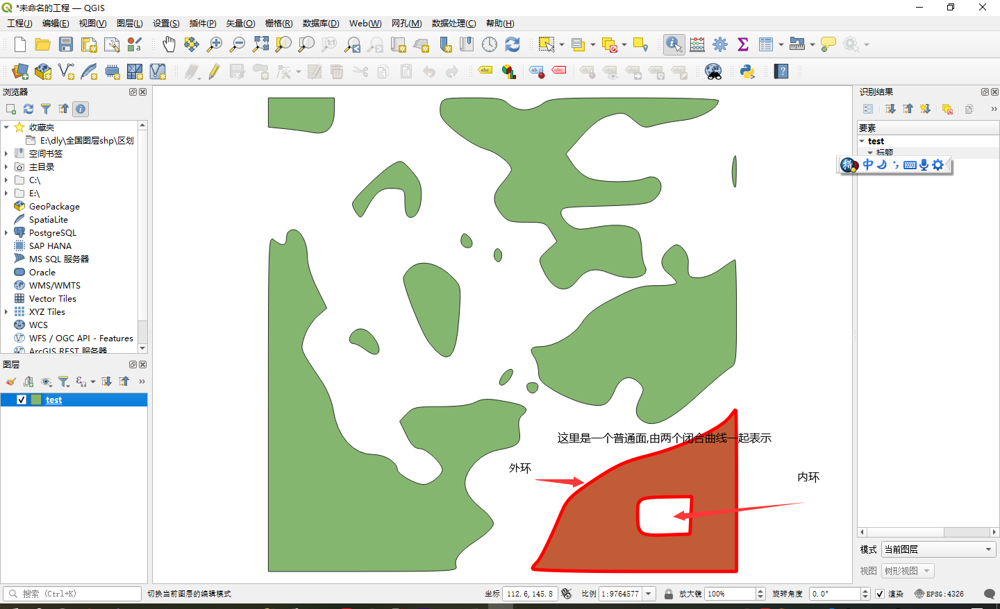

##  1. 环境

windows 10 

visual studio 2019 

vcpkg 

依赖的第三方库  vcpkg install opencv jsoncpp getopt


## 2. 方法摘要

+ #### 1.根据png构建 potrace_bitmap_s

```c++
potrace_state_s* ppc()
{
	cv::Mat pngMat = cv::imread("E:/ggg.png");
	potrace_bitmap_s* bitmap = bm_new(pngMat.cols, pngMat.rows);
	bm_clear(bitmap, 0);
	for (int r = pngMat.rows; r > 0; --r)
	{
		for (int c = 0; c * 8 < pngMat.cols; ++c)
		{
			unsigned int byd = 0;
			for (int kk = 0; kk < 8; ++kk)
			{
				byd <<= 1;
				if ((c * 8 + kk) < pngMat.cols)
				{
					if (pngMat.ptr<unsigned int>(r - 1, c * 8 + kk)[0] > 0)
					{
						byd |= 1;
					}
				}
			}
			byd ^= 255;
			std::cout << byd << " ";

			*bm_index(bitmap, c * 8, pngMat.rows - r) |= ((potrace_word)byd) << (8 * (BM_WORDSIZE - 1 - (c % BM_WORDSIZE)));;
		}
		std::cout << std::endl;
	}
	potrace_param_t* param_ = potrace_param_default();
	potrace_state_s* states = potrace_trace(param_, bitmap);
	return states;
}
```


## 3. 基本结构定义

+ #### 1. geojson 

  ```
  参照GeoJson http://www.geojson.cn/ 中下载的格式
  ```

+ #### 2. 数组表示 geo结构

  

  ​																					                  (图示 3-2-1)

  ```c++
  
  // 参照图示 3-2-1
  struct point {double x, double y}; // 表示一个点
  typedef std::vector<point> closed_ring; // 表示一个闭合曲线
  typedef std::vector<closed_ring> polygon; // 表示一个普通面 , 第一个闭合曲线表示 外环 , 其他曲线表示 内部的洞
  // 一个地图矢量可能由多个 polygon 组成, 一个多部分面 也可能由多个polygon 组成
  ```

  
